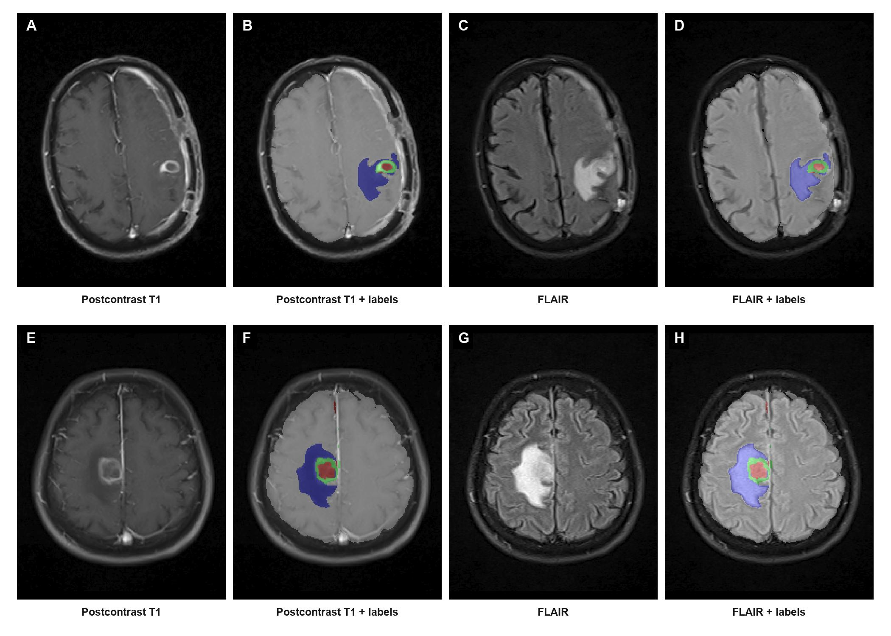

# Brain-Abscesses: AbscessSwinUNETR for Brain Abscess Segmentation

This repository contains a 3D medical image segmentation pipeline for brain abscess detection and segmentation from multi-modal MRI. The model is built around a SwinUNETR backbone and is adapted for two-stage brain and lesion segmentation. It is designed for clinical neuroimaging workflows where the goal is to localize the brain region and then separate lesion components such as edema, abscess, and ring enhancement.



## Overview

Brain abscess segmentation is a difficult 3D medical imaging problem because the lesion can be small, irregular, and surrounded by edema and normal brain tissue. This project addresses the problem by combining:

- a Swin Transformer-based 3D encoder-decoder backbone,
- a brain segmentation branch,
- a lesion segmentation branch,
- a registration and preprocessing pipeline for MRI modalities,
- a patch-based training strategy for volumetric MRI data.

The architecture is implemented in `src/networks/model.py` and the primary training pipeline is in `src/train_separate.py`.

## Model description: AbscessSwinUNETR

The project contains two relevant model wrappers in `src/networks/model.py`:

### 1) `AbscessSwinUNETR`

This is a single-output wrapper around a SwinUNETR backbone. It freezes the pretrained SwinUNETR parameters by default and replaces the final output layer with a custom 3D segmentation head. This version is useful when you want a simpler segmentation head for a single target map.

Key behavior:

- uses a SwinUNETR backbone,
- optionally freezes the original encoder/decoder,
- allows selective unfreezing of encoder or decoder blocks,
- supports a final `Conv3d` output projection.

### 2) `AbscessSepSwinUNETR`

This is the main model used in this repository for brain abscess segmentation. It uses a shared SwinUNETR feature extractor and then splits the decoder output into two pathways:

- `brain_out`: predicts the brain mask vs background,
- `lesion_out`: predicts lesion substructures such as edema, abscess, and ring.

This is implemented as a two-branch design:

- the shared SwinUNETR encoder extracts multi-scale features from the 4 MRI channels,
- the decoder path reconstructs high-resolution feature maps,
- separate output blocks produce:
  - brain segmentation logits,
  - lesion segmentation logits.

The outputs are then merged at inference time to produce the final 5-class segmentation map:

- 0 = background
- 1 = brain
- 2 = edema
- 3 = abscess
- 4 = ring enhancement

This design matches the repository's training and inference pipeline in `src/train_separate.py`, `src/test_separate.py`, and `src/main.py`.

## Use cases

This model is intended for:

- segmentation of brain abscess lesions from MR volumes,
- brain tissue localization in MRI,
- lesion subtype analysis (edema, abscess, ring enhancement),
- research in radiology and neuroimaging AI,
- preoperative and postoperative lesion quantification,
- development of computer-assisted diagnosis tools.

The project is especially useful when the input data are 3D multi-sequence MRI volumes such as:

- FLAIR
- T1
- T2
- T1C

The repo assumes that MRI data are co-registered to a common reference, usually FLAIR.

## Dataset format and preparation

The project expects volumetric NIfTI data and a label map with the same spatial grid.

### Recommended folder structure

A typical subject folder in the labeled dataset can look like this:

```text
dataset/labeled_dataset/
  subject_003/
    subject_003_FLAIR.nii.gz
    subject_003_T1.nii.gz
    subject_003_T2.nii.gz
    subject_003_T1C.nii.gz
    subject_003_Segmentation.nii.gz
```

In practice, this repository also creates patch-based directories and JSON annotation files:

```text
dataset/train_patches/
  subject003_patch001/
    subject003_patch001_FLAIR.nii.gz
    subject003_patch001_T1C.nii.gz
    subject003_patch001_T1.nii.gz
    subject003_patch001_T2.nii.gz
    subject003_patch001_label.nii.gz
```

### Label semantics

The segmentation labels follow these classes:

- 0: background
- 1: brain tissue
- 2: edema
- 3: abscess core
- 4: ring enhancement

These labels are used consistently in the training, validation, and inference scripts.

### MRI registration preprocessing

The first preprocessing step is spatial registration of all scans to the FLAIR image. This is handled by `src/labeling/register.py`.

The registration workflow is:

- read MRI scans as ANTs images,
- register T1, T2, and T1C to the FLAIR reference,
- save the registered images as NIfTI,
- keep the reference modality as the common anatomical space.

The main registration function is:

```python
register_seq_to_seq(seq, target_seq, out_path=..., transform_type="Affine")
```

This ensures all modalities are aligned before segmentation.

### Dataset loader

The dataset loading and preprocessing logic lives primarily in `src/data/data_utils.py`.

This file:

- reads the JSON annotation list,
- resolves image and label file paths,
- loads NIfTI data,
- applies intensity normalization,
- applies random spatial crops and augmentations during training,
- converts data to PyTorch tensors.

Main logic:

```python
files = data_read(datalist=datalist_json, basedir=data_dir)
loader = get_loader(...)
```

During training, the loader performs:

- image and label loading,
- one-hot conversion for multi-class labels,
- smoothing of labels,
- random crop to ROI size,
- flip augmentation,
- intensity normalization,
- random intensity shifts/scales.

### JSON annotation generation

The training JSON files under `jsons/` are generated using `src/labeling/train_json.py`.

This script scans a dataset directory, finds the modality files for each subject, and creates entries like:

```json
{
  "image": [
    "subject003_patch017/subject003_patch017_FLAIR.nii.gz",
    "subject003_patch017/subject003_patch017_T1C.nii.gz",
    "subject003_patch017/subject003_patch017_T1.nii.gz",
    "subject003_patch017/subject003_patch017_T2.nii.gz"
  ],
  "label": "subject003_patch017/subject003_patch017_label.nii.gz"
}
```

The repo uses JSON files such as:

- `jsons/train.json`
- `jsons/train_brain.json`
- `jsons/train_lesion.json`
- `jsons/valid.json`
- `jsons/valid_lesion.json`

These JSON files are the interface between the disk dataset and the PyTorch DataLoader.

## Training workflow

The main training script is `src/train_separate.py`.

This script:

1. loads training/validation data,
2. initializes a SwinUNETR backbone,
3. loads pretrained weights if configured,
4. wraps it in `AbscessSepSwinUNETR`,
5. freezes most of the model and unfreezes task-specific branches,
6. trains with a Dice-based loss and validation metric,
7. saves checkpoints to the `runs/train/` directory.

### Training configuration

The script defines model and training hyperparameters in the `main()` function, including:

- `logdir`
- `train_brain_data_dir` / `train_lesion_data_dir`
- `train_brain_json_list` / `train_lesion_json_list`
- `max_epochs`
- `batch_size`
- `optim_lr`
- `feature_size`
- `roi_x`, `roi_y`, `roi_z`

Common values in the project are:

- ROI = `(96, 96, 96)`
- feature size = `48`
- optimizer = `AdamW`
- learning rate = around `1e-5`

### How to start training

From the repository root:

```bash
python src/train_separate.py
```

If you need to change dataset paths, checkpoint paths, or hyperparameters, edit the defaults at the top of `main()` in `src/train_separate.py` before running it.

## Model testing

Testing is performed by `src/test_separate.py`.

This script:

- loads a saved model checkpoint,
- runs sliding-window inference on validation or test volumes,
- computes Dice, Precision, Recall, and F1 scores,
- optionally writes summary metrics to Excel files.

It supports both:

- brain segmentation,
- lesion segmentation,
- combined evaluation if desired.

## Single-patient inference

The inference script for one patient is `src/main.py`.

This pipeline is intended for real-world use on a single subject. It performs the following steps:

1. loads a patient's FLAIR, T1, T2, and T1C NIfTI files,
2. registers all MRI sequences to the FLAIR space,
3. normalizes and prepares the 4-channel input,
4. loads the trained model checkpoint,
5. runs 3D sliding-window inference,
6. saves the final prediction as a NIfTI file.

### How to run inference

From the repository root:

```bash
python ./src/main.py \
  --root "./dataset/test_set/90" \
  --flair "subject_090_FLAIR.nii.gz" \
  --t1 "subject_090_T1.nii.gz" \
  --t2 "subject_090_T2.nii.gz" \
  --t1c "subject_090_T1.nii.gz"
```

Optional arguments:

```bash
--checkpoint ./pretrained_models/final_sep_model.pt
--roi_size 128 128 128
--overlap 0.6
--sw_batch_size 1
--output_dir ./dataset/test_set/90/prediction
--output_name prediction.nii.gz
--device cuda
```

The script writes the final segmentation to a NIfTI file in the output directory. The output contains a 3D label volume with the class mapping:

- background = 0
- brain = 1
- edema = 2
- abscess = 3
- ring = 4

This is the recommended entry point for single-patient inference.

## Requirements and environment

Install dependencies from `requirements.txt`:

```bash
pip install -r requirements.txt
```

The project depends on:

- PyTorch
- Nibabel
- ANTsPy
- NumPy
- TorchMetrics
- OpenPyXL

## Recommended workflow

For a full training pipeline, the recommended order is:

1. prepare raw NIfTI data,
2. register all sequences to FLAIR using `src/labeling/register.py`,
3. build patch datasets,
4. generate JSON files using `src/labeling/train_json.py`,
5. train using `src/train_separate.py`,
6. evaluate with `src/test_separate.py`,
7. run patient-level inference via `src/main.py`.

## Contact

For questions, collaborations, or model usage inquiries:

- GitHub: https://github.com/samzmn
- LinkedIn: https://www.linkedin.com/in/sam-zmn/
- Email: sam.zmn99@gmail.com

## License

This repository is intended for academic and research use. Please contact the author before using the model in commercial or large-scale clinical deployment without permission.
